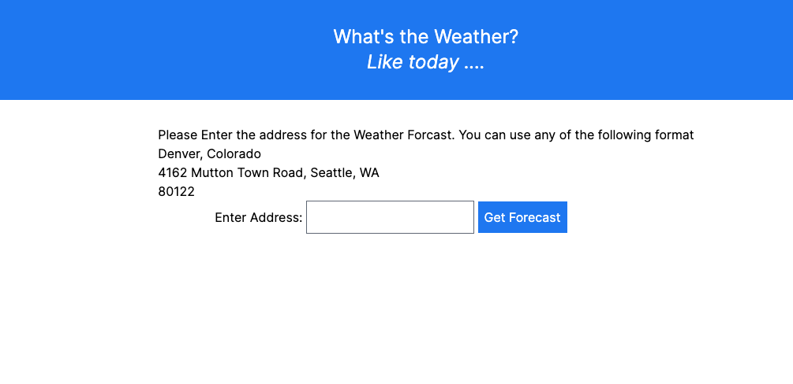
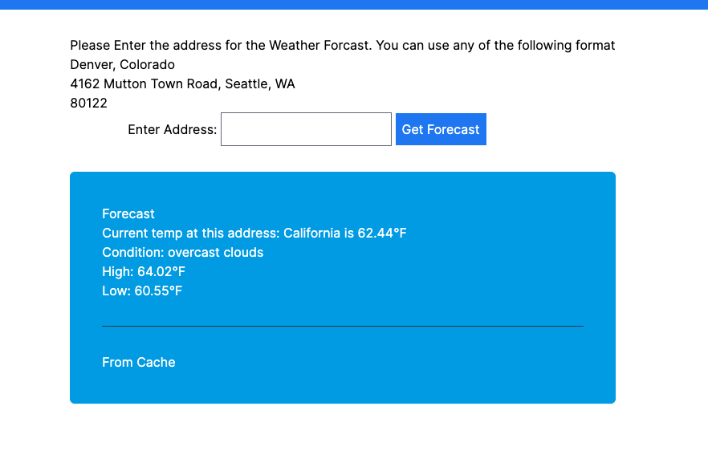

# whats-the-weather
Rails App to forecast weather for a given address. 

# Prerequistics 
Rails Version: 7.1.5.1
Ruby Version: 3.0.3

# Check out the repository 
`https://github.com/ze-corps/whats-the-weather.git`

# Start the rails server 
`rails s` or `bin/dev`

Now you can visit your localhost to use the application 

# Whats the Weather?
Whats the weather is a weather forecast app, that can forecast weather for a given address. It takes address as an input and returns the current Tempeture, Condition, High's and low's.
Input can be any address like: 
1. 96701 i.e ZipCode
2. California i.e. State
3. Douglas County, Colorado, i.e. County with state,
4. 4162 Mutton Town Road, Seattle, WA or a full address. 

This application uses gems like [Geocoder](https://github.com/alexreisner/geocoder) to get the coordinates of the location and [Faraday](https://github.com/lostisland/faraday) to make the API call for the weather forecast for https://api.openweathermap.org 

It stores the output in Cache for 30 minutes and displays the record from there if the record is already present. 
Currently for localhost we are just using Rails cache, but in future when its production ready we can replace it with Redis. 

# Here are some screenshots

